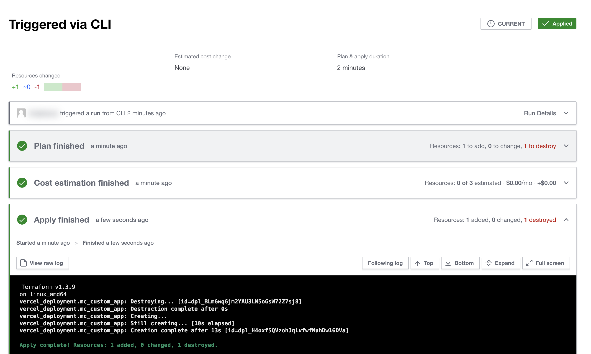

With the release of Custom Applications Deployment Previews feature users will be able to create as many static enviroments as they need in their daily work. For each of those environments a stable deployment URL must be configured via the deployment provider of choice. This may lead to some additional infrastructure configuration which in fact may be automated. This guide is a PoC of   the IaC-based infrastructure provisioned for the Custom Application Deployment Previews feature.

## Prerequisites

- Commercetools account, project and a Custom Application 
- GitHub account
- Terraform Cloud account (free-tier)
- Vercel account (free-tier)

## Infrastructure Components

Vercel service is used for hosting Custom Application. They offer a solid free-tier, possibility of configuring static URLs for environments and a Terraform Provider. All scripts for managing infrastructure configuration are hosted in a GitHub repo alongside the Custom Application source code. Terraform Cloud by Hashicorp is used for hosting the Terraform service state.

> Using GitLab would seem even more convenient. GitLab provides a free encrypted remote state service for Terraform, as well as full support for Terraform build tools on their platform. GitLab’s Terraform remote state is available to all projects and is viewable in the project’s menu list.

## Setting Provider Variables

- `Vercel` - in `Settings` -> `Tokens` a new token must be created
- `Terraform Cloud` account -> an organization must be created, a new workspace within the organization. In `Settings` -> `Variable sets` a new set must be created with a `VERCEL_API_TOKEN` created in Vercel 👆. It would be preferrable to create an organization/team access token. That is not however available as part of the free-tier. Therefore, in `User Settings` -> `Tokens` we can create a free user API token.
- `GitHub` - in the repo settings -> in `Secretts and variables` -> `Actions` a new token `TFC_API_TOKEN` secret must be created with the user API token value taken from 👆.

## Terraform code 

```t
# main.tf
terraform {
  cloud {
    hostname     = "app.terraform.io"
    organization = "provide_your_org_name"
    workspaces {
      name = "mc-app-test"
    }
  }

  required_providers {
    vercel = {
      source  = "vercel/vercel"
      version = "~> 0.11.4"
    }
  }
}

variable "is_prod" {
  description = "If false, deploys staging environment"
  default     = false
}

data "vercel_project_directory" "build_path" {
  path = "public"
}
resource "vercel_project" "mc_app_prod" {
  name      = "mc-app-prod"
}

resource "vercel_project" "mc_app_staging" {
  name      = "mc-app-staging"
}

resource "vercel_deployment" "mc_custom_app" {
  project_id  = var.is_prod ? vercel_project.mc_app_prod.id : vercel_project.mc_app_staging.id
  files       = data.vercel_project_directory.build_path.files
  path_prefix = "public"
  production  = true
}
output "preview_url" {
  value = vercel_deployment.mc_custom_app.url
}
```

## Custom Application setup

Custom Application config file:
```js
// custom-application-config.mjs
production: {
  // ...
  url: '${env:URL}',
},
```

`package.json` file:
```json
"scripts": {
  "build": "URL=https://mc-app-prod.vercel.app mc-scripts build",
  "build-staging": "URL=https://mc-app-staging.vercel.app mc-scripts build",
  // ...
}
```
> In here we hard-code the static URLs based on the Terraform config 👆. This can be optimized in real world scenario.

## GitHub action

```yaml
# .github/workflows/vercel.yaml

name: "Build and Deploy Preview Environment"

on:
  push:
    branches:
      - '**'
  pull_request:
    types: [opened, closed]

jobs:
  preview-environment:
    name: "Build and Deploy Preview Environment"
    runs-on: ubuntu-latest
    env:
      tfcOrg: provide_your_org_name
    steps:
      - name: Checkout
        uses: actions/checkout@v3
      - uses: actions/setup-node@v3
        with:
          node-version: 16
      - name: Install dependencies
        run: yarn install --frozen-lockfile
      - name: Build
        run: |
          if [ ${{ github.ref }} == 'refs/heads/main' ] 
          then
            yarn build
          else
            yarn build-staging
          fi
      - name: Setup Terraform
        uses: hashicorp/setup-terraform@v2
        with:
          cli_config_credentials_token: ${{ secrets.TFC_API_TOKEN }}
      - name: Build and deploy Prod Environment
        id: deploy-prod-or-staging-environment
        run: |
          terraform init -input=false
          if [ ${{ github.ref }} == 'refs/heads/main' ] 
          then
            terraform apply --auto-approve -var="is_prod=true"
          else
            terraform apply --auto-approve
          fi
```

## Output



## Key findings

<!-- TODO -->